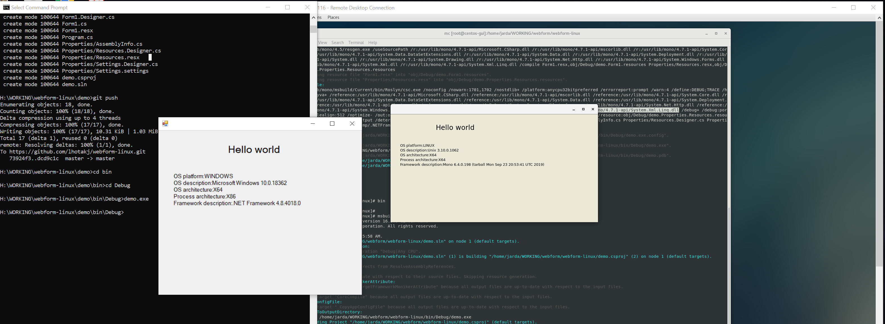

# webform-linux
simple .net 4.7.1 code to demonstrate interoperability

centos install
```
rpmkeys --import "http://pool.sks-keyservers.net/pks/lookup?op=get&search=0x3fa7e0328081bff6a14da29aa6a19b38d3d831ef"
su -c 'curl https://download.mono-project.com/repo/centos7-stable.repo | tee /etc/yum.repos.d/mono-centos7-stable.repo'
sudo yum install -y nuget mono-xbuild mono-develop
```

then run just inside the folder with .SLN file
```
msbuild
```
 



